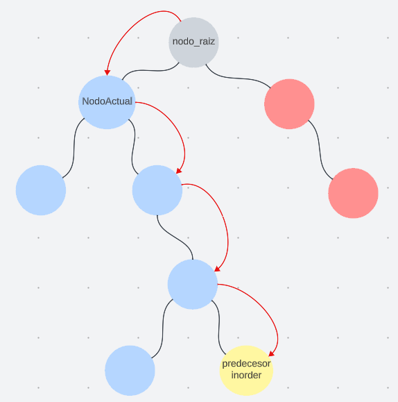
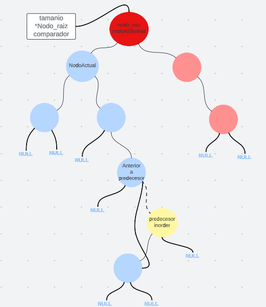
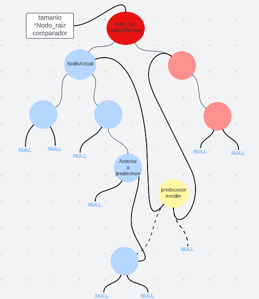
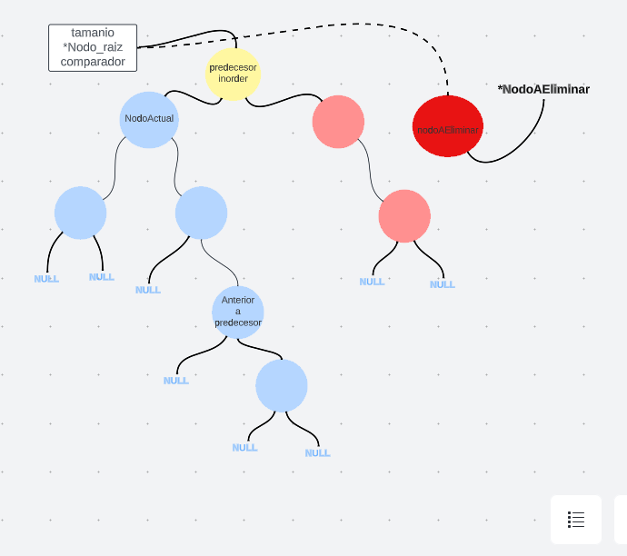
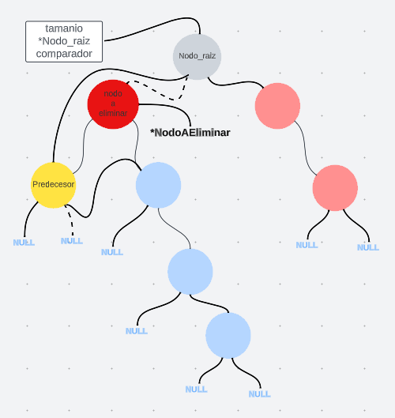
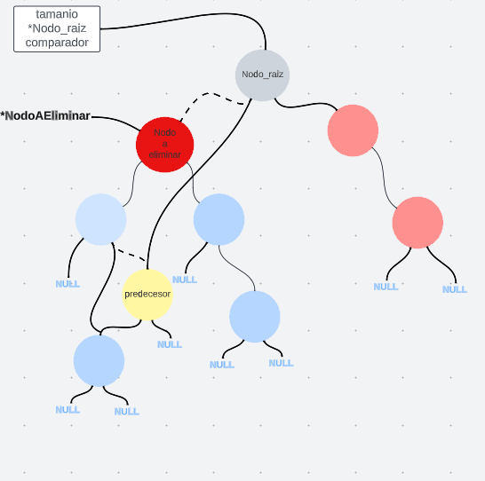
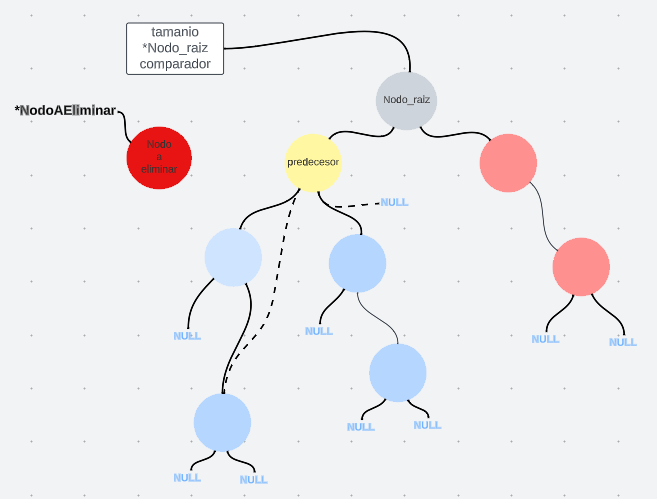
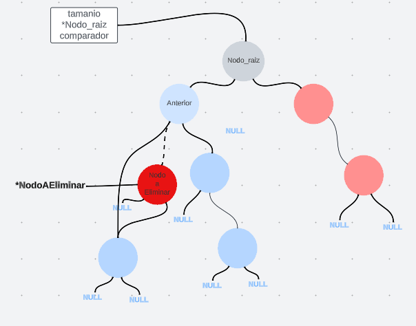

# TDA ABB

## Repositorio de (GASPAR AMATO) - (111137) - (gasparjamato@gmail.com)

- Para compilar:

```bash
gcc -o abb abb.c
```

- Para ejecutar:

```bash
./abb
```

- Para ejecutar con valgrind:
```bash
valgrind ./abb
```
---
##  Funcionamiento

```c
nodo_abb_t *nodo_abb_crear(void *elemento)
```
Esta funcion recibe un "void *", crea un nodo y devuelve un puntero nodo creado. Esto lo hace, primero, reservando memoria con un malloc en el heap. La memoria resrvada es la cantidad de bytes que tiene el struct nodo_abb_t, luego un puntero nodo apunta a ese malloc. Despues hago que el nodo, el cual tiene la forma del struct:
```c
struct nodo_abb {
	void *elemento;
	struct nodo_abb *izquierda;
	struct nodo_abb *derecha;
};
```
hago que elemento apunte al "void *" recibido y luego que izquierda y derecha apunten a NULL. 
La complejidad de esta funcion es O(1)


```c
abb_t *abb_crear(abb_comparador comparador)
```
Esta funcion recibe una funcion "comparador" y crea un abb luego devuelve un puntero al abb creado y reserva memora en el heap, luego hace que el nodo raiz apunte a null, que el comparador del arbol apunte a la funcion recibida por parametros y que el tamaño del arbol sea 0;
La complejidad tambien es O(1)


```c
abb_t *nodo_insertar_en_lugar_correspondiente(nodo_abb_t *nodoBusqueda, int (*comparador)(void *, void *), nodo_abb_t *nodoAinsertar, abb_t *arbol)
```
Esta funcion recibe un puntero al nodoBusqueda, el cual voy a utilizar para que vaya "cambiando" hacia la derecha o la izquierda a lo largo de la funcion, ya que utilizo recursividad en esta funcion; un puntero a la funcion comparador, la cual recibe dos elementos y los compara si abos elementos son iguales devuleve 0, si elemento1 es mayor a elemento2 devuelve un int mayor que cero, sino devuelve uno mayor que cero; un puntero al nodo que insertare y un puntero al abb en donde quiero insertar ese nodo.

Primero compara con la funcion comparador el elemento de nodoAinsertar y el elemento del nodoBusqueda y luego si:
1- el comparador devuelve un valor menor o igual que uno, primero pregunta si hay otro nodo a la izquierda, si no hay, se encontro donde almacenarlo y hace que el nodo de la izquierda de nodoBusqueda (que es el nodo donde esta parada la funcion) apunte al nodo a insertar, pero si no es NULL entonces la funcion se llama a si misma pero en nodobusqueda pone el nodo que esta a la izquierda, ya que el comparador nos dijo que el valor a insertar es menor al nodo actual. 
2- El comparaddor devuelve un valor mayor a 0, hace lo mismo pero que todo apunte hacia la derecha.

Notese que si se ingresan dos nodos con elementos iguales, el segundo nodo se insertara a la izquierda del nodo igual a si. 
La complejidad en el mejor caso es O(log(n)) y en el peor O(a), siendo que "n" es la cantidad de nodos del arbol y "a" es la cantidad de niveles del arbol.

```c
abb_t *abb_insertar(abb_t *arbol, void *elemento)
```
Esta funcion recibe un arbol y un elemento y devuelve el mismo arbol pero con un nodo mas que contiene al elemento, en la posicion correcta.
primero crea al nodo con la funcion nodo_abb_crear() y le inserta el elemento pasado por parametros. Luego pregunta si el arbol esta vacio, si es asi inserta el nodo en la raiz del arbol, sino con la funcion nodo_insertar_en_lugar_correspondiente() explicada anteriormente, busca el lugar correspondiente donde insertar el nodo.

la complejidad en el mejor de los casos es O(1) si el arbol esta vacio y sino depende de la complejidad de nodo_insertar_en_lugar_correspondiente().

```c
nodo_abb_t *buscarNodoPadre(abb_t *arbol, nodo_abb_t *nodoAbuscar, nodo_abb_t *nodoActual)
```
Esta funcion se comporta casi igual a la funcion anterior a la hora de buscar nodos ya que con el comparador va viendo si debe recorrer el arbol hacia la derecha o hacia la izquierda, pero en los condicionales se pregunta si el siguiente nodo (en el primer caso a la izquierda y en el segundo caso a la derecha) es el nodo al cual le estamos buscando el nodo padre, si es asi devuleve un puntero a es nodo.
Es una funcion recursiva la cual en el mejor de los casos es O(log(n)) ya que a cada paso se va reduciendo a la mitad la busqueda y en el caso en que el nodoAbuscar es un nodo hoja del ultimo nivel (el cual es el pero caso ) la complejidad es de O(a-1) siendo "a" la altura del arbol,pongo a-1 porque es el anterior al ultimo nivel.

```c
nodo_abb_t *nodo_reemplazo(nodo_abb_t *nodoActual)
```
Esta funcion recibe un nodo y recorre la rama a la cual pertence ese nodo todo hacia la derecha, y devuelve un puntero al ultimo nodo de la rama hacia la derecha, osea que recorre la rama hasta que el siguiente del lado derecho sea NULL.
Esta funcion la utilizo mas adelante para encontrar el predecesor inorder de algun nodo, ya que inserto en nodoActual al siguiente del lado izquierdo de un nodo luego recorro todo hacia la derecha hasta el NULL y ese es el predecesor inorder.Asi como lo muestro en este diagrama:

<div align="center">

</div>
El diagrama muestra el predecesor inorder del nodo raiz del abb el cual esta marcado en amarrillo, como se puede ver la funcion comienza desde nodoActual y se va desplazando hasta llegar al nodo amarrillo.

La complejidad en el peor de los casos de esta funcion es O(a-k), siendo "a" la altura del arbol y "k" el nivel del nodo insertado(nodoActual). El peor de los casos seria que el predecesor este en el ultimo nivel del arbol.


```c
void abb_quitar_con_2_hijos(nodo_abb_t *nodoAEliminar, abb_t *arbol)
```
Esta funcion explora el caso de eliminar un nodo el cual tenga dos hijos, la funcion recibe el nodoAEliminar y el arbol de donde sacarlo.

Al principio de esta funcion se declaran tres punteros que utilizare a lo largo de la funcion para poder eliminar el nodo estos son:

*nodoReemplazo: Utiliza la funcion nodo_reemplazo() para buscar el predecesor inorder, o sea que esta variable almacena un puntero al nodo predecesor inorder del nodoAEliminar.

*anteriorAPredecesor: Utiliza la funcion BuscarNodoPadre() para buscar el nodo padre del nodoReemplazo.

*anteriorAEliminado: Utiliza la funcion BuscarNodoPadre() para buscar el nodo padre del nodoAEliminar.

El primer if() pregunta si el nodoAEliminar es igual al nodo raiz, si es as procede a eliminarlo, para este trabajo se pidio reemplazar un nodo con dos hijos con el predecesor inorder, entonces lo que hago para hacer eso es:
1. El puntero derecha del padre del predecesor lo apunto al puntero izquierda del nodo reemplazo. Esto es valido porque todos los elementos del subarbol izquierdo del predecesor son mayores al elemento del nodoReemplazo. Solo necesito re-acomodar la parte izquierda del nodo predecesor(nodoReemplazo) ya que este nodo por definicion solo puede tener NULL en su puntero derecho.
<div align="center">

</div>

2. Hago que el puntero derecho del nodoReemplazo o sea el predecesor apunte, al puntero derecho del nodoAeliminar, en este caso del nodo raiz, y lo mismo con el izquierdo.
<div align="center">

</div>

3. Por ultimo hago que el puntero nodo_raiz del ABB apunte al predecesor.
<div align="center">

</div>

Sin embargo si el anterior al predecesor es justo el nodoAEliminar, en este caso al nodo raiz, no debo omitir la parte donde el puntero izquierdo del nodo reemplazo apunta al puntero izquierdo del nodo a eliminar, ya que el nodo se estaria referenciando a si mismo y produciria un error a la hora de recorrer el arbol, esto sucede si el predecesor es justo el nodo izquierdo al nodo a eliminar.
 
 Si el nodo a eliminar no es el nodo raiz entonces yo continue asi:
 1. Si el puntero derecha del padre del nodo a eliminar es igual al nodo a eliminar, entonces las posibilidades se resumen en dos:
    A- Si el anterior al predecesor es el nodo a elimina, entonces el putero derecho del padre de nodo a eliminar debe apunatar al nodoReemplazo y el puntero de la derecha del nodo reemplazo debe apunatar al nodo derecho de nodo a eliminar.

    B-Sino el puntero derecho al anterior al predecesro debe apuntar al de la izquierda del predecesor y el puntero derecho al padre del nodo a eliminar debe apunatar al nodo reemplazo.
  2. Si el puntero izquierdo del anterior al nodo a eliminar es el nodo a eliminar entonces hago lo mismo que hivce antes pero para la izquierda como lo muestra la siguiente imagen:
    CASO 1:
 <div align="center">

</div>
    CASO 2:
PRIMERO:
<div align="center">

</div>
LUEGO:
<div align="center">

</div>

La complejidad de esta funcion depende directamente de las funciones nodo_reemplazo() y BuscarNodoPadre(). y seria la suma de esas complejidades, explicadas anteriormente.


```c
void abb_quitar_con_1_hijo(abb_t *arbol, nodo_abb_t *nodoAEliminar)
```
Esta funcion aborda el caso en donde se quiera eliminar un nodo con un solo hijo y en la variable anterior almacena el padre al nodo eliminar.

Si el nodo a eliminar es el nodo raiz entonces la funcion se fija si el nodo hijo es el el derecho o el o izquierdo y en base a eso decide a si el puntero nodo raiz del abb apunta al izquierdo o al nodo derecho del nodo raiz a eliminar.

Si no es el nodo raiz el problema se divide en dos, o el puntero derecha del nodo anterior es el nodo a eliminar o o el puntero izquierdo lo es. 
En el primer caso lo que hace el programa es averiguar si ese unico hijo es el izquierdo o el derecho y en base a eso hace que el nodo aterior apunte al nodo siguiente al nodo eliminar.
<div align="center">

</div>
este ejemplo es el caso donde el nodo a eliminar es el izquierdo al anterior y su hijo es el nodo derecho.
la complejidad depende de la funcion buscarNodoPadre().

```c
void abb_quitar_con_0_hijo(abb_t *arbol, nodo_abb_t *nodoAEliminar)
```
Esta funcion explora los casos en donde el nodono tiene hijos, por eso si el nodo a eliminar es el nodo raiz, hace que el nodo raiz apunte a NULL. Si el nodo es una hoja del arbol pregunta si el puntero derecha del nodo anterior es el nodo eliminar hace que ese puntero apunte a NULL, y si es el izquierdo hace que el puntero izquierda del nodo anterior apunte a NULL. 
La complejidad depende de la funcion busacrNodoPadre().

```c
void *abb_quitar(abb_t *arbol, void *elemento)
```
Esta funcion lo que hace es buscar un el nodo a eliminar con el elemento proporcionado y luego a traves de los if() determina cual de las funciones quitar debe utilizar:
1. si ambos hijos del nodo apuntan a NULL utiliza la funcion abb_quitar_con_0_hijo().

2. Con el operador XOR "^" determina si 1 y solo 1 de sus nodos hijos es igual a NULL, si ambos son NULL o ambos son diferentes a NULL devolvera false y no continuara, pero sino utilza la funcion abb_quitar_con_0_hijo().

3. si no se cumplen ninguno de los dos anterioes llama a la funcion abb_quitar_con_2_hijos().

luego de esto disminuye el tamaño del arbol y libera la memoria del nodo a eliminar.

la complejidad de la funcion depende las funciones abb_quitar_con_0_hijo(), abb_quitar_con_1_hijo(), abb_quitar_con_2_hijos() mas la funcion buscar_nodo(), por lo que la complejidad podria ser de O(log(n)) + O(log(n)).


```c
nodo_abb_t *buscar_nodo(nodo_abb_t *nodoBusqueda, void *elemento, int (*comparador)(void *, void *))
```
Esta funcion devuelve el primer nodo que coincida con el elemento pasado por parametros, utiliza la funcion comparador para determinar si el elemento es mayor o menor al elemento de  nodoBusqueda, si el elemento es menor entonces recorre el arbol hacia la izquierda y si es mayor hacia la derecha, si los elementos coinciden devuleve un puntero al nodo encontrado.
La complejidad es O(log(n)) porque la busqueda siempre se va achicando a la mitad. La funcion es recursiva.

```c
void abb_destruir_nodo(nodo_abb_t* nodoActual)
```
Esta funcion primero va liberando los nodos del arbol de forma postorder. 
su complejidad es de o(n) porque siempre debe recorrer todos los nodos del arbol.

```c
void abb_destruir(abb_t *arbol)
```
Llama a la funcion abb_destruir_nodo() y luego cuando se ejectua toda la funcion libera la memoria reservada para el arbol.


```c
void abb_destruir_todo_nodos(nodo_abb_t* nodoActual, void (*destructor)(void *))
```
La funcion se ejecuta de manera postorder, liberando primero los nodos hijos izquierdos, luego los nodos hijos derechos y finalmente el nodo actual. En cada nodo visitado, se llama a la funcion destructor en donde inserto el elemento. Finalmente, se libera la memoria ocupada por el nodo actual.
En el mejor caso, si el arbol está perfectamente balanceado, la complejidad sería O(log n)

```c
bool abb_con_cada_elemento_inorden(nodo_abb_t *nodoActual, bool (*funcion)(void *, void *), void *aux, contador_t *contador)

bool abb_con_cada_elemento_preorden(nodo_abb_t *nodoActual, bool (*funcion)(void *, void *), void *aux, contador_t *contador)

bool abb_con_cada_elemento_postorden(nodo_abb_t *nodoActual, bool (*funcion)(void *, void *), void *aux, contador_t *contador)
```
1. abb_con_cada_elemento_inorden(): Realiza un recorrido inorden del ABB, lo que significa que primero visita el hijo izquierdo, luego el nodo actual y finalmente el hijo derecho. En cada nodo, aplica una funcion a su elemento junto con un parametro auxiliar. Si en algún momento la funcion devuelve false, la funcion deja de procesarse.

2. abb_con_cada_elemento_preorden(): Realiza un recorrido preorden del ABB, lo que significa que primero visita el nodo actual, luego el hijo izquierdo y finalmente el hijo derecho. Aplica la funcion al elemento de cada nodo junto con el parametro auxiliar. Si la funcion devuelve false en algun momento, la funcion termina.

3. abb_con_cada_elemento_postorden(): Realiza un recorrido postorden del ABB, lo que significa que primero visita el hijo izquierdo, luego el hijo derecho y finalmente el nodo actual. Aplica la funcion al elemento de cada nodo junto con el parametro auxiliar. Si la funcion devuelve false en algun momento, la funcion termina.

En el pero de los casos todas estas funciones son O(N) ya que recorren todos los nodos del ABB.

```c
size_t abb_con_cada_elemento(abb_t *arbol, abb_recorrido recorrido, bool (*funcion)(void *, void *), void *aux)
```
Esta funcion determian si el recorrido es INORDER, PREORDER o POSTORDER, y dependiendo de cual sea ejecuta las diferentes funciones de recorrido explicadas anteriormente.

```c
size_t abb_recorrer(abb_t *arbol, abb_recorrido recorrido, void **array,size_t tamanio_array)
```
recorrer un árbol binario de búsqueda en un orden específico (INORDER, PREORDER o POSTORDER) y almacenar los elementos en un arreglo dinámico. Verifica que las condiciones para el recorrido sean validas y crea un contador para mantener un registro de los elementos almacenados. Luego, segun el tipo de recorrido, llama a la funcion correspondiente para llenar el arreglo. Finalmente, devuelve la cantidad de elementos almacenados en el arreglo y libera la memoria del contador. 

--- 

## Respuestas a las preguntas teóricas
1. Explique teóricamente qué es una árbol, árbol binario y árbol binario de búsqueda. Explique cómo funcionan, cuáles son sus operaciones básicas(incluyendo el análisis de complejidad de cada una de ellas) y por qué es importante la distinción de cada uno de estos diferentes tipos de árboles.

Un árbol es una estructura de datos que consta de nodos, los cuales esatan conectadors entre si y esta "ordenados" jerarquicamente, o sea por niveles. Los arboles tienen, un nodo raiz, el cual es el primer nodo; nodos hoja que son los nodos sin hijos.

Un arbol binario es un tipo de arbol el cual cada nodo padre puede tener como maximo dos nodos hijos, uno derecho y uno izquierdo.

Un arbol binario de busqueda(ABB) es un tipo especifico de arbol binario que tiene la particularidad de que sus nodos estas ordenaods de la forma en que los subarboles del lado izquierdo de cualquier nodo son menores a el y todos los subarboles del lado derecho a el son mayores. 

Cada arbol tiene sus diferentes utilidades, si la estructura que requeris necesita de un cierto orden entonces utiliza abb y sino dependiendo de las necesidades se puede usar cualquier otro arbol.

Primitivas de un ABB:

1. insercion():  Para insertar un elemento en un ABB, se compara el valor del elemento con el nodo actual y se decide si debe ir a la izquierda o la derecha. Luego, se repite el proceso en el subarbol correspondiente hasta encontrar un lugar adecuado para la insercion. 

2. Busqueda: Para buscar un elemento en un ABB, se compara el valor con el nodo actual y se decide si el elemento se encuentra en el subarbol izquierdo o derecho. La busqueda continua en el subarbol correspondiente hasta encontrar el elemento deseado o determinar que no existe. 

3. Eliminacion: Para eliminar un elemento de un ABB, se busca el elemento, y dependiendo de la situacion, se puede reemplazar con el sucesor inmediato o el predecesor inmediato o simplemente eliminarlo si es un nodo hoja.

La complejidad en el peor de los casos es O(a) donde "a" es la altura del arbol y la complejidad promedio es de O(log(n)).
